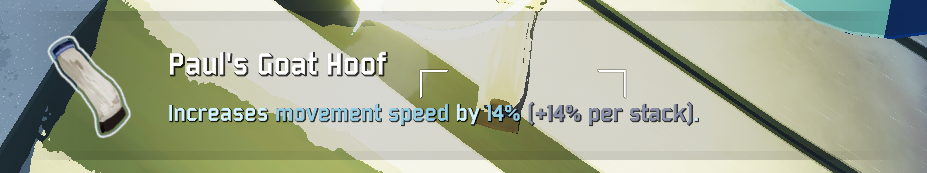
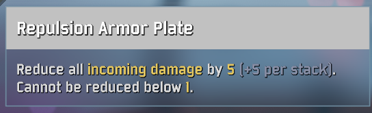

# Risk of Rain 2 Better Item Description
Replace ingame item descriptions with more accurate ones, as seen in the log book.

# Installation
1.) Place the file (python or exe) into your Risk of Rain 2 language folder.   
Default: "C:\Program Files (x86)\Steam\steamapps\common\Risk of Rain 2\Risk of Rain 2_Data\StreamingAssets\Language\en"      
2.) Run file

# Examples:

